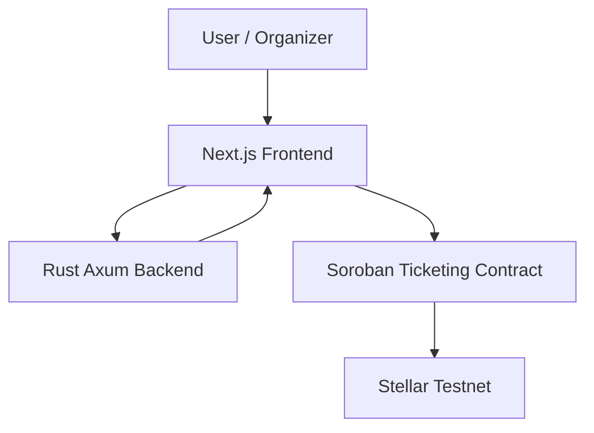

# StellarPass

StellarPass is an open-source, blockchain-based digital ticketing MVP prototype powered by the Stellar network and Soroban smart contracts. It provides cryptographic ownership of tickets, prevents duplicate ticket issuance, and enables secure ticket verification and on-chain check-in.

**Note:** This is an MVP prototype deployed on the **Stellar Soroban Testnet**. It is designed for demonstration and open-source contribution.

## Live Testnet Deployment

The StellarPass smart contract is actively deployed on the Stellar Testnet.

- **Network:** Stellar Soroban Testnet
- **Deployed Contract ID:** `CDA7WVAH5PSQC3G7O5KMLB63LOYTZAJZ3N5ZQPIMZ6YFY5RRRVL36UUC`
- **Wallet Integration:** Requires the [Freighter](https://freighter.app/) wallet configured for Testnet.

The Soroban contract acts as the strict, authoritative source of truth for all ticket and event states. The Rust backend is solely responsible for serving off-chain event metadata and providing API endpoints.

### Implemented MVP Lifecycle

StellarPass currently implements the following end-to-end lifecycle on Testnet:

1. **Create Event:** Organizers register an event identity on-chain while saving metadata off-chain.
2. **Issue Ticket:** Organizers mint unique tickets directly to a recipient's Stellar wallet.
3. **Verify Ticket:** Attendees present generated QR codes, which the application verifies securely against the Soroban contract.
4. **Check-In:** Organizers perform an on-chain transaction to mark the ticket as checked in, preventing double-entry.
5. **Deactivate Event:** Organizers can deactivate an event. Once inactive, the Soroban contract explicitly rejects any further ticket issuance or check-ins for that event.

Traditional digital ticketing systems suffer from major flaws:

- **Scalping & Counterfeiting:** Tickets can be duplicated as screenshots or PDFs.
- **Double Entry:** The same ticket can potentially be presented to multiple people.
- **Lack of Verifiable Ownership:** Attendees rely on centralized platforms to prove ticket ownership.
- **Limited Transparency:** Ticket validity and check-in status are usually controlled by a centralized database.

## Why Blockchain & Soroban?

StellarPass uses the Stellar network and Soroban smart contracts to make the blockchain the authoritative source of truth for security-critical ticket information.

The Soroban contract:

- Prevents duplicate ticket IDs.
- Records ticket ownership on-chain.
- Restricts ticket issuance to authorized event organizers.
- Allows ticket validity to be verified against the blockchain.
- Prevents a checked-in ticket from being checked in again.
- Provides a transparent record of ticket state.

The frontend and backend handle user-facing functionality and off-chain metadata, while the Soroban contract maintains the authoritative ticket state.

## Current MVP Capabilities

- **Event Management:** Create events and store event metadata off-chain while registering the event identity on-chain.
- **Ticket Issuance:** Issue unique tickets directly to a recipient's Stellar wallet address.
- **Ticket Verification:** Generate QR codes from tickets and verify them through a dedicated scanner interface.
- **On-Chain Check-In:** Authorized organizers can check tickets in through an on-chain transaction.
- **Ticket Ownership:** Ticket ownership is recorded and verified through the Soroban contract.
- **Duplicate Prevention:** The contract prevents duplicate ticket issuance and prevents already checked-in tickets from being reused.

## Architecture

StellarPass uses a hybrid architecture that separates authoritative on-chain ticket state from off-chain event metadata.



### Components

- **Frontend:** A Next.js application that provides the user interface, ticket pages, QR code generation, event management, and wallet interactions.

- **Backend:** A Rust Axum service responsible for storing and serving off-chain event metadata and providing API endpoints.

- **Soroban Contract:** The authoritative source of truth for security-critical event and ticket state, including ticket issuance, ownership, verification, and check-in.

- **Stellar Testnet:** Hosts the deployed Soroban smart contract and provides the blockchain infrastructure for on-chain operations.

The backend stores event metadata separately from the blockchain, while the Soroban contract maintains the security-critical ticket state.

See the [Architecture Document](docs/ARCHITECTURE.md) for more details.

## Project Structure

```text
StellarPass/
├── apps/
│   ├── backend/              # Rust Axum backend
│   └── frontend/             # Next.js frontend
│
├── contracts/
│   └── ticketing/            # Soroban ticketing smart contract
│
├── docs/
│   ├── ARCHITECTURE.md       # System architecture
│   ├── DEVELOPMENT.md        # Development setup
│   └── TICKETING_FLOW.md     # Ticket lifecycle
│
├── .github/
│   └── workflows/
│       └── ci.yml            # GitHub Actions CI
│
├── CONTRIBUTING.md
├── LICENSE
├── package.json
└── README.md
```

## Local Setup & Development

StellarPass consists of three main components:

1. **Soroban smart contract**
2. **Rust Axum backend**
3. **Next.js frontend**

See the [Development Setup Guide](docs/DEVELOPMENT.md) for detailed instructions on installing the required tools, configuring the project, running the applications, and deploying the Soroban contract.

### Requirements

You will need:

- Node.js
- npm
- Rust and Cargo
- Soroban CLI
- A Stellar-compatible wallet such as Freighter
- Git

### Environment Variables

The frontend relies on environment variables defined in `.env`.

Copy the example environment file:

```bash
cp apps/frontend/.env.example apps/frontend/.env.local
```

Then configure the required Stellar contract information, including:

```text
NEXT_PUBLIC_STELLAR_CONTRACT_ID=<your-contract-id>
```

Refer to the development documentation for the complete configuration.

### Install Dependencies

From the repository root:

```bash
npm ci --include=dev
```

### Run the Frontend

```bash
npm run dev --workspace=apps/frontend
```

The frontend can then be accessed through the local development server.

### Run the Backend

From the repository root:

```bash
cargo run --manifest-path apps/backend/Cargo.toml
```

The backend runs on port `3001` by default.

### Run Tests

Backend tests:

```bash
cargo test --manifest-path apps/backend/Cargo.toml
```

Soroban contract tests:

```bash
cargo test --manifest-path contracts/ticketing/Cargo.toml
```

Check Rust formatting:

```bash
cargo fmt --manifest-path apps/backend/Cargo.toml -- --check
```

Build the frontend:

```bash
npm run build --workspace=apps/frontend
```

## Freighter Wallet Requirement

StellarPass uses the Freighter wallet for Stellar transactions.

To interact with the application:

1. Install the Freighter browser extension.
2. Configure Freighter for the Stellar Testnet.
3. Fund the wallet with Testnet XLM.
4. Connect the wallet to StellarPass.

The wallet is used to sign transactions that interact with the Soroban contract.

## How the Ticket Lifecycle Works

The ticketing flow is a hybrid process involving both the backend and the Soroban contract.

### 1. Event Creation

Event metadata such as the name, date, venue, and description is stored through the backend.

An event identity is also registered on the Soroban contract.

### 2. Ticket Issuance

An authorized organizer issues a ticket to the recipient's Stellar wallet address.

The Soroban contract records the ticket and its owner on-chain.

### 3. Ticket Generation

The frontend generates a QR code containing the information required to identify the ticket.

### 4. Ticket Verification

At the event, the attendee presents the QR code.

The verifier scans the QR code and the frontend queries the Soroban contract to determine whether the ticket exists and is valid.

### 5. Check-In

An authorized organizer performs the check-in transaction.

The ticket state is updated on-chain so that the same ticket cannot be checked in again.

### 6. Event Deactivation

An organizer can deactivate the event when it concludes. The Soroban contract will subsequently reject any new ticket issuance or check-ins for this event.

See the [Ticketing Flow Document](docs/TICKETING_FLOW.md) for a deeper explanation and [TESTNET_DEMO.md](docs/TESTNET_DEMO.md) for verifiable on-chain demonstration transactions.

## Security Model

The Soroban contract is the authoritative source for security-critical ticket state.

The backend should not be treated as the source of truth for:

- Ticket ownership
- Ticket validity
- Ticket issuance authorization
- Check-in status

Instead, these states are verified against the blockchain.

The backend is primarily responsible for off-chain metadata and supporting application functionality.

## Testing & Continuous Integration

StellarPass uses GitHub Actions to automatically validate contributions.

The CI pipeline checks:

- Soroban contract tests
- Backend tests
- Rust formatting
- Frontend installation
- Frontend production build

Contributors should ensure these checks pass before opening a pull request.

## Current MVP Limitations / Future Work

StellarPass is currently a functional Testnet MVP. We are actively inviting open-source contributions to mature the system for production.

Current limitations and planned future work include:

- Transitioning from in-memory backend storage to persistent PostgreSQL.
- Implementing trustless background indexing of Soroban events to link metadata.
- Support for secure on-chain ticket transfers.
- Role-Based Access Control (RBAC) to delegate scanner capabilities.

See [ROADMAP.md](docs/ROADMAP.md) for the complete list of planned improvements.

See [CONTRIBUTING.md](CONTRIBUTING.md) for contribution guidelines.

## Contributing

Contributions are welcome.

To contribute:

1. Fork the repository.
2. Create a feature branch.
3. Make your changes.
4. Run the relevant tests and formatting checks.
5. Commit your changes.
6. Push your branch.
7. Open a pull request.

For more information, see [CONTRIBUTING.md](CONTRIBUTING.md).

## License

This project is licensed under the MIT License. See [LICENSE](LICENSE) for more information.
