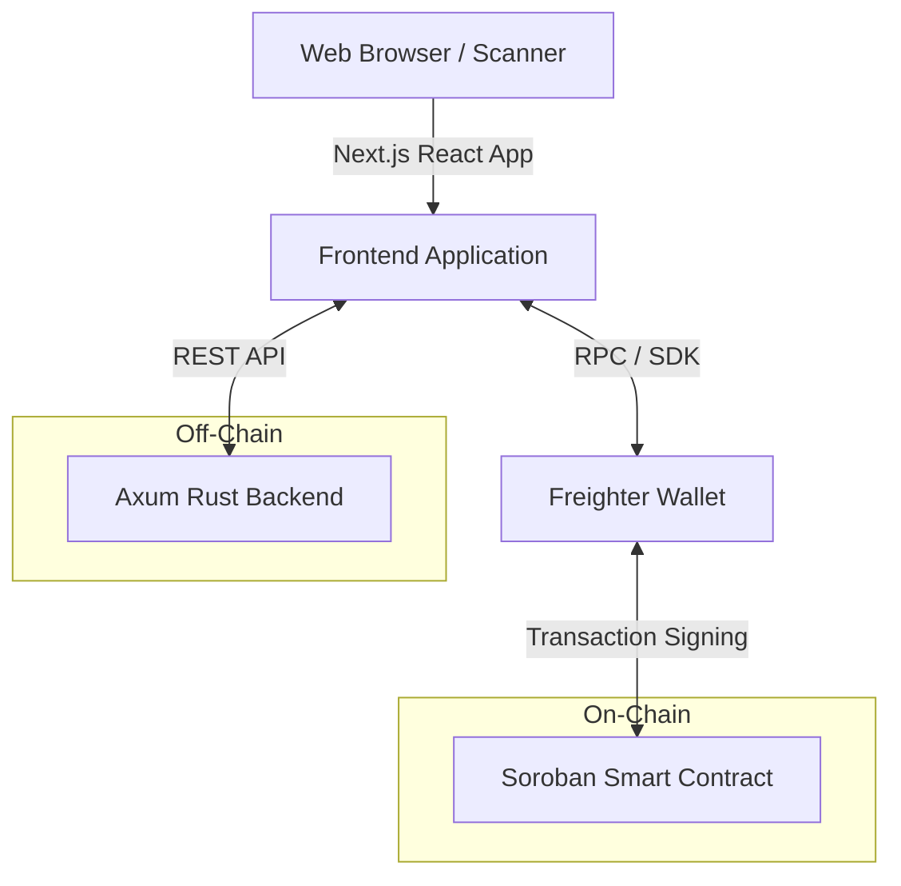

# StellarPass Architecture

StellarPass is designed around a hybrid architecture: it uses the Stellar Soroban blockchain as the ultimate, authoritative source of truth for ticketing state, while utilizing an off-chain backend to store heavy, non-critical metadata.

## High-Level System Architecture

## Component Responsibilities

### 1. Frontend (Next.js / React / TypeScript)

The frontend serves as the primary interface for event organizers and attendees.

- **Responsibilities**:
  - UI for Event Creation, Ticket Issuance, and Dashboard Management.
  - Integration with the `Freighter` wallet for transaction signing.
  - QR Code generation (for ticket sharing) and scanning (via device camera) for verification.
  - Displaying the `/ticket` and `/verify` routes.
- **Key Flow**: It orchestrates the process of saving metadata off-chain _before_ deploying the authoritative ID on-chain.

### 2. Backend (Rust / Axum)

The backend acts as a fast, off-chain registry. In the current MVP, it uses an in-memory `RwLock<HashMap>` to store data, keeping the setup minimal for open-source contributors.

- **Responsibilities**:
  - Storing bulky event metadata (Name, Description, Venue, Date) that is too expensive or unnecessary to store on-chain.
  - Providing REST endpoints (`POST /api/events`, `PATCH /api/events/:id`) for the frontend.
- **Crucial Rule**: The backend is **never** the source of truth for ticket ownership, check-in status, or event validity. It is strictly a metadata index.

### 3. Soroban Smart Contract (Rust)

The Soroban contract is the core security layer.

- **Responsibilities**:
  - Maintaining the registry of active Events and issued Tickets.
  - Enforcing authorization rules (e.g., only the exact wallet that created an event can issue tickets for it or check attendees in).
  - Storing the immutable check-in state of a ticket to prevent double-entry and fraud.
  - Supporting event deactivation to securely prevent further ticket issuance or check-ins for concluded or canceled events.

## Data Flow: On-Chain vs. Off-Chain

StellarPass uses a referencing system to link the two domains:

1. When an event is created, the Backend generates a UUID (`metadata_ref`).
2. This `metadata_ref` is saved into the Soroban contract during the `create_event` transaction.
3. Simultaneously, the `event_id` (a `u64` generated for the blockchain) is patched back to the Backend.
4. When looking up an event, the system uses the blockchain `event_id` to query Soroban for the authoritative state, and the Backend for the human-readable text.

## Authorization Model

StellarPass leverages Soroban's native `require_auth()` capability.

- **Event Creation**: The caller's address is saved as the `organizer`.
- **Ticket Issuance**: The contract checks `organizer.require_auth()` and verifies the caller matches the stored `organizer` for the event. The contract also strictly enforces that the event is currently active.
- **Check-In**: The operator performing the check-in must match the `organizer` address exactly, preventing rogue actors from validating tickets. The contract also strictly enforces that the event is currently active.
- **Event Deactivation**: Only the original `organizer` can deactivate an event. Once inactive, the contract rejects any further ticket issuance or check-in attempts.

## Current Limitations & Future Architecture

- **Persistent Database**: The MVP backend uses in-memory storage. A future iteration will transition to PostgreSQL via SQLx or Diesel.
- **Event Indexing**: Currently, the backend relies on the frontend to explicitly send `PATCH` requests to link blockchain IDs. A robust future architecture will involve a background worker scraping Stellar Horizon for `create_event` contract events to index data trustlessly.
- **Role-Based Access Control (RBAC)**: The contract currently only allows a single `organizer` wallet to perform check-ins. Future iterations will allow the organizer to delegate "Scanner" roles to other wallets.
