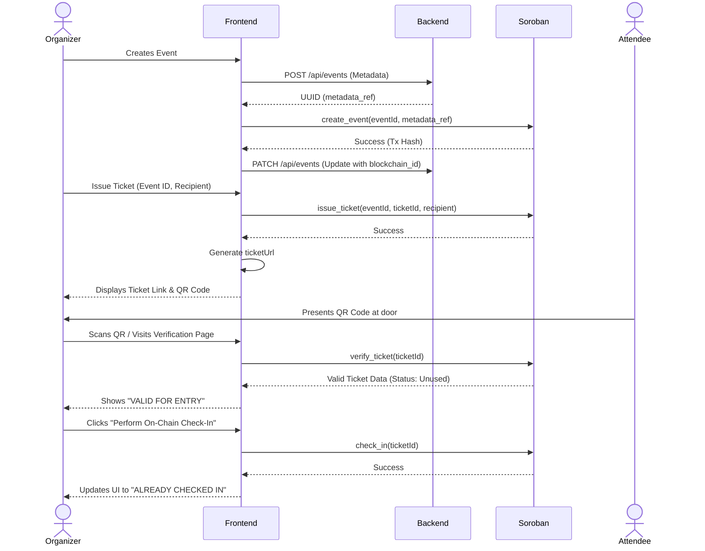

# StellarPass Ticketing Flow

This document explains the complete user journey and technical lifecycle of a ticket in the StellarPass system.

## The Complete Lifecycle

## Step-by-Step Breakdown

### 1. Event Creation
1. **Organizer Input**: The organizer connects their Freighter wallet and fills out the event details (Name, Date, Venue, Description).
2. **Metadata Storage**: The frontend submits this data to the Axum backend. The backend stores it in memory and returns a UUID (`metadata_ref`).
3. **On-Chain Registration**: A unique `u64` blockchain event ID is generated (`Date.now()`). The frontend prompts Freighter to sign a `create_event` transaction to the Soroban contract using the event ID and the `metadata_ref`.
4. **Linkage**: The backend record is updated with the blockchain event ID, creating a bridge between off-chain metadata and on-chain authority.

### 2. Ticket Issuance
1. **Action**: The organizer selects an event and inputs the recipient's public wallet address.
2. **Execution**: A unique `u64` ticket ID is automatically generated. The frontend submits an `issue_ticket` transaction to Soroban.
3. **Success**: Soroban records the ticket on-chain. The frontend then opens a dedicated ticket page (`/ticket/{ticketId}`) displaying the ticket details and a generated QR code.

### 3. Ticket Verification
1. **Presentation**: The attendee shows their digital ticket's QR code at the event entrance.
2. **Scanning**: The organizer uses a scanner (or their device camera via the `/verify` page) to read the QR code, which contains the ticket URL.
3. **Validation**: The `/verify` page queries the Soroban contract using `verify_ticket`. If the ticket exists, it displays its status. If the ticket is invalid or does not exist, an error is shown immediately.

### 4. On-Chain Check-In
1. **Authorization**: If the ticket is valid, the organizer (who must be authenticated via Freighter as the event creator) clicks the "Perform On-Chain Check-In" button.
2. **State Change**: A `check_in` transaction is signed and broadcast to Soroban.
3. **Confirmation**: The contract verifies the organizer's signature and marks the ticket's `checked_in` boolean as `true`.
4. **Finality**: The UI updates to show the ticket is now "ALREADY CHECKED IN". Any future attempts to check in this ticket will fail at the smart contract level, preventing double-entry.
